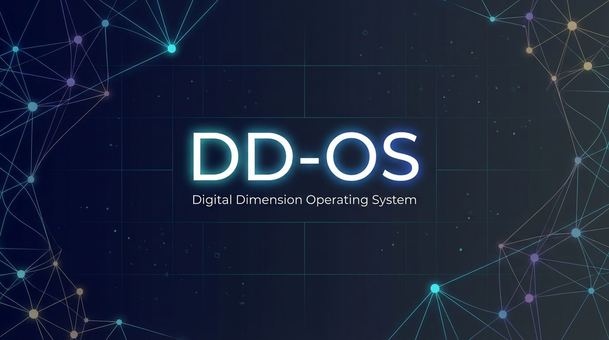

<div align="center">



# DunCrew

### Give AI a Workstation -- Not Just a Chatbox

The AI operating system that learns, evolves, and remembers.

[](LICENSE)
[](https://www.typescriptlang.org/)
[](https://reactjs.org/)
[](https://python.org/)
[](https://www.electronjs.org/)

[GitHub](https://github.com/FatBy/DunCrew) | [Skills Hub](https://github.com/FatBy/DunCrew/tree/main/skills)

</div>

---

## What is DunCrew?

**DunCrew** is a self-evolving AI operating system running entirely on your local machine. Unlike AI assistants that treat every conversation as a blank slate, DunCrew builds **persistent expertise** -- each workflow node (**Dun**) develops its own memory, knowledge base, scoring history, and operational genes through use.

Built on a ReAct execution engine with Reflexion self-correction, Critic verification, SOP evolution, and Wiki knowledge accumulation, DunCrew turns a stateless chatbot into a **trainable specialist that gets smarter over time**.

---

## Interface Preview

DunCrew replaces the traditional chatbox with an explorable digital world:

<table>
<tr>
<td align="center"><b>World View</b><br/>Each Dun is a trainable AI expert<br/></td>
<td align="center"><b>AI Chat Panel</b><br/>ReAct execution with tool calls<br/></td>
</tr>
<tr>
<td align="center"><b>Memory Palace</b><br/>L0/L1 memory + exec traces<br/></td>
<td align="center"><b>Skill Academy</b><br/>40+ skills with stats tracking<br/></td>
</tr>
</table>

---

## Why DunCrew?

| Capability | DunCrew | Typical AI Agents |
|---|---|---|
| **Per-domain memory** | L1 Hot/Cold split per Dun + L0 global knowledge | Flat session history |
| **Wiki knowledge base** | Entity-Claim-Evidence structured wiki per Dun | None |
| **SOP evolution** | Auto-refined standard operating procedures | Static prompts |
| **Knowledge promotion** | Multi-signal confidence scoring, auto-promote to global | None |
| **Self-correction** | Reflexion (structured retry) + Critic (result verification) | Simple retry |
| **Experience harvesting** | Gene Pool with confidence decay + cross-Dun sharing | None |
| **Soul evolution** | Dual-layer MBTI + behavioral amendment system | Static persona |
| **Observer** | Dual-path analysis, skill/Dun auto-discovery | None |
| **Execution scoring** | 0-100 per Dun, streak bonuses, tool dimension tracking | None |
| **Dangerous op control** | 3-level risk classification + user approval flow | Basic confirmation |

---

## Architecture

```
  GitHub / Web / MCP Servers / Local Tools
               |
               v   (MCP Standard Protocol)
  +-------------------------------+
  |     Python Backend (server/)  |  <-- Tool Execution + Wiki + Memory
  |  Modular Handlers | Hybrid    |
  |  Search (FTS5 + Vector)       |
  +---------------+---------------+
                  |  (HTTP REST API)
  +---------------+---------------+
  |      ReAct Execution Engine   |  <-- Task Orchestration
  |  Reflexion | Critic | Genes   |
  +---------------+---------------+
                  |
  +---------------+---------------+
  |    Dun Context Engine         |  <-- Memory & Context
  |  L1-Hot | L1-Cold | L0       |
  |  Wiki KB | SOP | Gene Pool   |
  +---------------+---------------+
                  |
  +---------------+---------------+
  |         Observer              |  <-- Self-Evolution
  |  Skill Discovery | Dun       |
  |  Discovery | Insight Mining  |
  +-------------------------------+
                  |
       [LLM API: GPT-4o / DeepSeek / Qwen / Claude / ...]
```

---

## Core Systems

### Dun -- Trainable AI Experts

Each **Dun** is an evolvable workflow node with its own brain:

- **Level Progression**: XP earned per execution, visual upgrades on level-up
- **Independent Scoring**: 0-100 scale with streak bonuses and tool-dimension tracking
- **Wiki Knowledge Base**: Entity-Claim-Evidence structured knowledge, auto-ingested from execution
- **SOP Evolution**: Standard operating procedures that auto-refine based on fitness tracking
- **Per-Dun Context Engine**: Each Dun maintains its own L1 memory, context budget, and token management
- **Bound Skills**: Compose multiple skills into specialized workflows
- **Custom Model Assignment**: Different LLMs for different Duns

**Built-in Duns:**

| Dun | Purpose |
|-----|---------|
| novel-master | Long-form fiction writing |
| paper-killer | Academic paper assistance |
| competitive-analyst | Competitive intelligence research |
| xiaohongshu-writer | Social media content creation |
| private-lawyer | Legal document review |
| zhouyi-diviner | Traditional divination analysis |

### Two-Tier Memory + Wiki Knowledge

DunCrew implements a biologically-inspired memory architecture with structured knowledge:

**L1 Memory (Per-Dun, Private)**
- **L1-Hot**: Recent action snapshots as structured metadata
- **L1-Cold**: Semantic RAG retrieval via FTS5 + vector similarity + temporal decay

**L0 Memory (Global, Shared)**
- High-confidence L1 memories get **promoted** to L0 after passing multi-signal validation
- L0 memories accessible by ALL Duns, enabling cross-domain knowledge transfer

**Wiki Knowledge Base (Per-Dun + Global)**
- **Entity-Claim-Evidence** structured storage in SQLite
- Auto-ingested from execution traces and AI responses via LLM pipeline
- **Semantic search** with hybrid FTS5 + vector similarity scoring
- **Batch operations**: archive, tag, categorize, delete with cascade
- **LLM Librarian**: AI-powered knowledge base audit -- detects stale content, duplicates, and conflicts
- **Usage-as-verification**: searchWiki hits increment usage counts, feeding confidence signals
- **Knowledge temperature**: log-compressed heat scoring (hot/warm/cold) with anti-Matthew effect
- Knowledge lint service for quality assurance
- Injected into Dun context during execution for informed decision-making

**Confidence Signals:**

| Signal | Delta | Source |
|--------|-------|--------|
| Environment Assertion | +0.15 | Critic verifies tool output |
| Human Approval | +0.15 | User approves high-risk operation |
| Human Rejection | -0.15 | User rejects operation |
| System Failure | -0.20 | Tool execution fails |

### Observer -- Self-Evolution Engine

The Observer performs dual-path analysis after each execution:

- **Skill Discovery**: Detects recurring tool patterns and proposes new skills
- **Dun Discovery**: Clusters user intents to suggest new specialized Duns
- **Insight Mining**: Extracts actionable insights and writes them to memory
- **SOP Fitness Tracking**: Monitors execution success rates to trigger SOP rewrites

### Soul Evolution -- Dual-Layer Personality

**Layer 1: Factory Constitution (Immutable)**
- Defined in `SOUL.md`: identity, core truths, boundaries, vibe statement
- MBTI personality derived from rules-based axis scoring

**Layer 2: Behavioral Amendments (Dynamic)**
- Cross-Dun behavioral pattern detection
- Amendments carry weight (0~1) with 30-day half-life decay
- User approval workflow: draft -> approved -> archived

### Gene Pool -- Self-Healing Experience Library

- **Auto-Harvesting**: Detects failure-then-success patterns in execution traces
- **Reflexion Injection**: Matching repair genes injected as hints during error recovery
- **Cross-Dun Sharing**: Genes from one Dun help others facing similar errors
- **Confidence Lifecycle**: Success boosts confidence, failure decays it, old genes naturally retire

### ReAct Engine -- Self-Correcting Execution

- **Function Calling**: OpenAI-compatible tools API with structured output
- **Reflexion**: On failure, triggers structured self-reflection -- not blind retry
- **Critic Verification**: After file writes and shell commands, automatically verifies the result
- **Dangerous Operation Approval**: 3-tier risk classification (critical/high/medium) with user approval
- **Background Queue**: Priority-based LLM call scheduling with exponential backoff

---

## Seven Core Modules

| Module | Description |
|--------|-------------|
| **World View** | Dun node map with drag interaction and theme switching |
| **Task Monitor** | Running/completed tasks with real-time execution tracking, SOP sidebar |
| **Skill Academy** | Skill grid/mind-map views with stats, analysis, and creation |
| **Memory Palace** | L0/L1 memory wall, exec trace timeline, base analysis |
| **Soul Tower** | Soul config, dual-layer MBTI evolution, behavioral amendments, bootstrap |
| **Link Station** | MCP server management and data chain visualization |
| **Library** | Wiki knowledge browser: semantic search, three-layer navigation (home / category / detail), batch ops, LLM Librarian audit, knowledge temperature heatmap |

---

## Quick Start

### Requirements

| Dependency | Version |
|------------|---------|
| Node.js | >= 18 (v20+ recommended) |
| Python | >= 3.10 |
| Git | Latest |

### Step 1: Clone

```bash
git clone https://github.com/FatBy/DunCrew.git
cd DunCrew
```

### Step 2: Install Dependencies

```bash
# Frontend
npm install

# Backend
pip install -r requirements.txt
```

### Step 3: Launch

**Windows:**
```bash
# Double-click DunCrew.bat, or:
start-standalone.bat
```

**Manual Launch (all platforms):**

```bash
# Terminal 1 -- Backend
python duncrew-server.py --port 3001

# Terminal 2 -- Frontend
npm run dev
```

**Electron Desktop App:**
```bash
npm run electron:dev
```

Open **http://localhost:5173** in your browser (or use the Electron app).

### Step 4: Configure LLM

1. Click **Settings** in the left sidebar
2. Fill in Base URL, API Key, and Model name

### Supported Providers

| Provider | Recommended Models | Base URL |
|----------|-------------------|----------|
| OpenAI | gpt-4o, gpt-4o-mini | `https://api.openai.com/v1` |
| DeepSeek | deepseek-chat, deepseek-reasoner | `https://api.deepseek.com/v1` |
| Qwen | qwen-plus, qwen-max | `https://dashscope.aliyuncs.com/compatible-mode/v1` |
| Claude | claude-3.5-sonnet | Via OpenAI-compatible proxy |
| SiliconFlow | Various open-source models | `https://api.siliconflow.cn/v1` |

Any OpenAI-compatible API endpoint works.

---

## Skill System

### Built-in Tools

| Tool | Description |
|------|-------------|
| `readFile` / `writeFile` | File I/O with auto File Registry tracking |
| `runCmd` | Shell commands (with 3-tier safety approval) |
| `webSearch` / `webFetch` | Web search and page fetching |
| `saveMemory` / `searchMemory` | Two-tier memory read/write |
| `listDir` | Directory listing with auto-registration |
| `browseUrl` | Browser automation |

### 40+ Skills

DunCrew ships with 40+ skills covering:

| Category | Skills |
|----------|--------|
| **Code** | coding-agent, code-runner, code-search, code-knowledge-butler, frontend-design |
| **Research** | deep-research, web-search, browser-automation, critical-evaluation |
| **Writing** | prose, docx, markdown-formatter, summarize |
| **Presentation** | powerpoint-pptx, frontend-slides, canvas |
| **Image** | openai-image-gen, image-understand, ocr-extract, screen-capture |
| **Meta** | skill-creator, skill-scout, skill-executor, self-improving-agent |
| **Strategy** | strategic-planning, structured-reasoning, diverse-ideation, meta-pattern-recognition |

### Create Custom Skills

```
skills/my-skill/SKILL.md
```

```markdown
---
name: my-skill
description: My custom skill
version: 1.0.0
---

# Instructions

What this skill does and how it works...
```

Skills hot-reload without restart.

---

## Project Structure

```
DunCrew/
├── src/                     # React + TypeScript frontend
│   ├── components/          # UI components
│   │   ├── ai/             # Chat panel, messages, progress
│   │   ├── houses/         # Module views (7 houses)
│   │   ├── world/          # World view, Dun detail/create
│   │   └── shared/         # Shared UI (wiki-ui, file card)
│   ├── services/            # 40+ service modules
│   │   ├── LocalClawService.ts     # ReAct execution engine (core)
│   │   ├── dunContextEngine.ts     # Per-Dun context management
│   │   ├── knowledgeIngestService.ts  # Wiki knowledge pipeline
│   │   ├── sopEvolutionService.ts  # SOP fitness & evolution
│   │   ├── genePoolService.ts      # Gene harvesting & matching
│   │   └── ...
│   ├── store/slices/        # Zustand state management
│   └── utils/               # Utilities
├── server/                  # Python backend (modular)
│   ├── handlers/            # 17 route handlers
│   │   ├── wiki.py          # Wiki knowledge CRUD
│   │   ├── memory.py        # Memory read/write
│   │   ├── traces.py        # Execution trace analysis
│   │   ├── duns.py          # Dun management
│   │   ├── skills.py        # Skill registry
│   │   └── ...
│   ├── library/             # Document library pipeline
│   └── db.py                # SQLite + FTS5
├── electron/                # Electron desktop app
├── skills/                  # 40+ skill definitions
├── duns/                    # Built-in Dun definitions
├── duncrew-server.py        # Server entry point
└── .github/workflows/       # CI/CD (build + release)
```

---

## Tech Stack

| Layer | Technology |
|-------|-----------|
| Frontend | React 18 + TypeScript + Vite + Zustand + Tailwind CSS + Framer Motion |
| Rendering | Canvas 2D (GameCanvas engine with theme system) |
| Backend | Python modular server with 17 handler modules |
| Storage | SQLite (FTS5 + vector hybrid search) + Wiki Entity-Claim tables |
| Desktop | Electron (with auto-updater) |
| Protocol | HTTP REST API + MCP Standard Protocol |
| CI/CD | GitHub Actions (build + release workflows) |

---

## Security

- All API keys stored locally, never uploaded
- Backend binds to `127.0.0.1` (localhost only)
- 3-tier dangerous command classification with approval dialogs
- File operations sandboxed to workspace directory
- Sensitive config (`data/llm_config.json`) excluded from version control

---

## Contributing

We welcome contributions! Check out our [open issues](https://github.com/FatBy/DunCrew/issues).

```bash
# Development workflow
npm install
npm run dev              # Frontend dev server
python duncrew-server.py # Backend server
npx tsc --noEmit         # Type check before committing
```

---

## License

MIT
