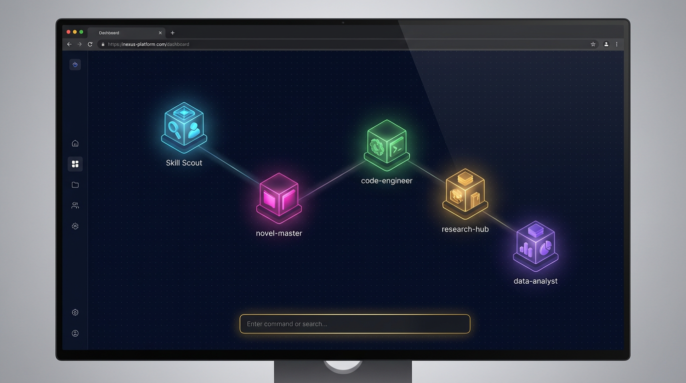
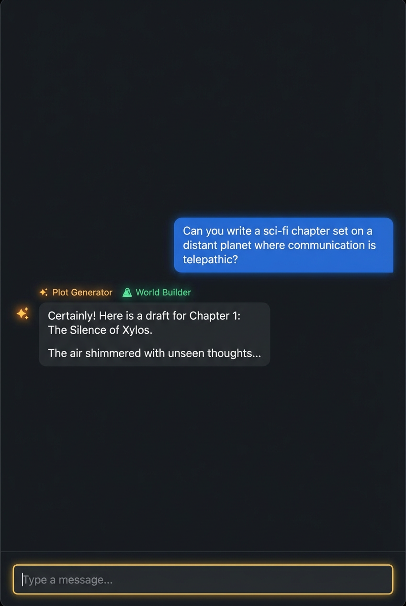
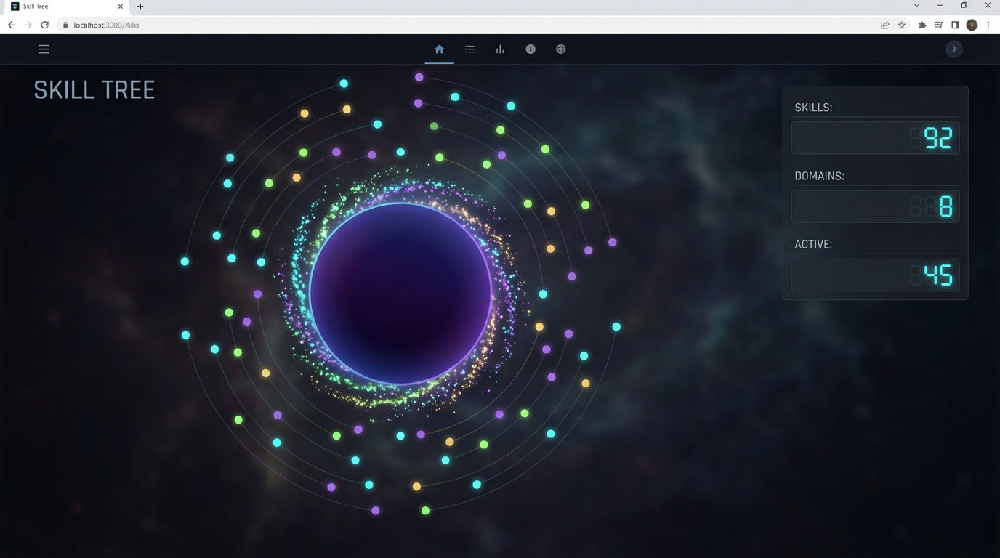
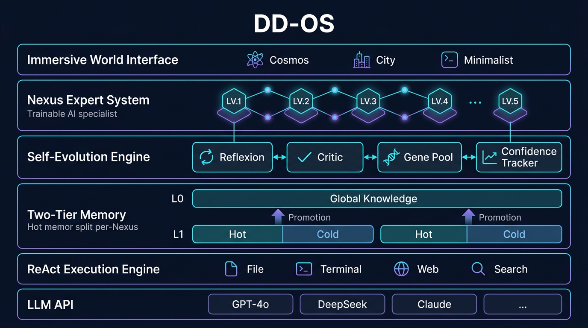

<div align="center">


### The AI that learns, evolves, and remembers -- not just chats.

[](LICENSE)
[](https://www.typescriptlang.org/)
[](https://reactjs.org/)
[](https://python.org/)

[GitHub](https://github.com/FatBy/DD-OS) | [Skills Hub](https://github.com/FatBy/DD-OS/tree/main/skills) | [Examples](examples/)

</div>

---

## What is DD-OS?

**DD-OS** (Digital Dimension Operating System) is a self-evolving AI operating system that runs entirely on your local machine. Unlike traditional AI assistants that treat every conversation as a blank slate, DD-OS builds **persistent expertise** -- each workflow node (Nexus) develops its own memory, scoring history, and operational genes through use.

Built on a ReAct execution engine with Reflexion self-correction, Critic verification, and confidence-based knowledge promotion, DD-OS turns your AI from a stateless chatbot into a **trainable specialist that gets smarter over time**.

---

## Interface Preview

DD-OS replaces the traditional chatbox with an explorable digital world. Three visual themes available:

<table>
<tr>
<td align="center"><b>Minimalist</b><br/>Floating particles, breathing glow<br/></td>
<td align="center"><b>Cosmos</b><br/>Deep space planets, orbital rings<br/></td>
<td align="center"><b>Cityscape</b><br/>Isometric pixel city tiles<br/></td>
</tr>
</table>

<table>
<tr>
<td align="center"><b>World View (with Nexuses)</b><br/>Each node is a trainable AI expert<br/></td>
</tr>
</table>

<table>
<tr>
<td align="center"><b>AI Chat Panel</b><br/>ReAct execution with tool calls<br/></td>
<td align="center"><b>Skill Tree</b><br/>92 skills with particle visualization<br/></td>
</tr>
</table>

<table>
<tr>
<td align="center"><b>Settings</b><br/>OpenAI-compatible API config<br/></td>
</tr>
</table>

---

## Why DD-OS?

Most AI agent frameworks give you a loop: *plan, act, observe, repeat*. DD-OS goes further with **self-evolution primitives** that no other open-source framework provides:

| Capability | DD-OS | Typical AI Agents |
|---|---|---|
| **Per-domain memory** | L1 Hot/Cold split per Nexus + L0 global knowledge | Flat session history |
| **Knowledge promotion** | Multi-signal confidence scoring, auto-promote to global | None |
| **Self-correction** | Reflexion (structured retry) + Critic (result verification) | Simple retry |
| **Experience harvesting** | Gene Pool with confidence decay | None |
| **File awareness** | O(1) File Registry, zero redundant exploration | Re-explore every time |
| **Execution scoring** | 0-100 per Nexus, streak bonuses, tool dimension tracking | None |
| **Dangerous op control** | 3-level risk classification + user approval flow | Basic confirmation |

---

## Architecture



```
  GitHub / Slack / Local Bash / MCP Servers / Web
               |
               v   (MCP Standard Protocol)
  +-------------------------------+
  |     ddos-local-server.py      |  <-- Tool Execution Layer
  |      (Python / MCP Host)      |
  +---------------+---------------+
                  |  (HTTP REST API)
  +---------------+---------------+
  |      ReAct Execution Engine   |  <-- Task Orchestration
  |   Reflexion | Critic | Genes  |
  +---------------+---------------+
                  |
  +---------------+---------------+
  |   Nexus Context Engine        |  <-- Memory & Context
  |   L1-Hot | L1-Cold | L0       |
  |   File Registry | Gene Pool   |
  +---------------+---------------+
                  |
       [LLM API: GPT-4o / DeepSeek / Claude / ...]
```

---

## Core Systems

### Nexus -- Trainable AI Experts

Each Nexus is not just a prompt template -- it's an **evolvable workflow node** with its own brain.

- **Level Progression**: XP earned per execution, visual upgrades on level-up
- **Independent Scoring**: 0-100 scale with streak bonuses and tool-dimension tracking
- **Bound Skills**: Compose multiple SKILLs into specialized workflows
- **SOP Memory**: Standard operating procedures that persist across sessions
- **Per-Nexus Context Engine**: Each Nexus maintains its own L1 memory and context budget
- **Custom Model Assignment**: Different LLMs for different Nexuses

### Two-Tier Memory -- Knowledge That Grows

DD-OS implements a biologically-inspired memory architecture:

**L1 Memory (Per-Nexus, Private)**
- **L1-Hot**: Last 5 turns as structured action snapshots (metadata only, not raw output)
- **L1-Cold**: Semantic RAG retrieval via FTS5 + vector similarity + temporal decay

**L0 Memory (Global, Shared)**
- High-confidence L1 memories get **promoted** to L0 after passing multi-signal validation
- Promotion requires: `confidence >= 0.7` AND `3+ independent signals`
- L0 memories accessible by ALL Nexuses, enabling cross-domain knowledge transfer

**Confidence Signals:**

| Signal | Delta | Source |
|--------|-------|--------|
| Environment Assertion | +0.15 | Critic verifies tool output |
| Human Approval | +0.15 | User approves high-risk operation |
| Human Rejection | -0.15 | User rejects operation |
| System Failure | -0.20 | Tool execution fails |

**File Registry** -- Every file operation is auto-registered with O(1) lookup. The agent never wastes turns re-exploring known paths.

### ReAct Engine -- Self-Correcting Execution

The execution engine goes beyond basic plan-act loops:

- **Task Decomposition**: Complex tasks auto-split into executable sub-steps
- **Tool Calling**: File I/O, shell commands, web search, MCP tools, and 90+ skills
- **Reflexion**: On failure, triggers structured self-reflection with error analysis -- not blind retry
- **Critic Verification**: After file writes and shell commands, automatically verifies the result
- **Digital Immune System**: Failure pattern signatures matched against self-healing scripts
- **Dangerous Operation Approval**: 3-tier risk classification (critical/high/medium) with user approval flow
- **Gene Pool Harvesting**: Successful execution patterns extracted as reusable "genes" with confidence tracking

---

## Quick Start

### Requirements

| Dependency | Version |
|------------|---------|
| Node.js | >= 18 (v20+ recommended) |
| Python | >= 3.10 |
| Git | Latest |

### Step 1: Clone

```bash
git clone https://github.com/FatBy/DD-OS.git
cd DD-OS
```

### Step 2: Install Dependencies

```bash
# Frontend
npm install

# Python (optional, for YAML support)
pip install pyyaml
```

### Step 3: Launch

**Windows:**
Double-click `start.bat` in the project root.

**macOS:**
Double-click `DD-OS.command` in Finder.

**Manual Launch (all platforms):**

```bash
# Terminal 1 -- Backend
python ddos-local-server.py --path ~/.ddos --port 3001

# Terminal 2 -- Frontend
npm run dev
```

Open **http://localhost:5173** in your browser.

---

## API Configuration


1. Click **Settings** in the left sidebar
2. Fill in Base URL, API Key, and Model name

### Supported Providers

| Provider | Recommended Models | Base URL |
|----------|-------------------|----------|
| OpenAI | gpt-4o, gpt-4o-mini | `https://api.openai.com/v1` |
| DeepSeek | deepseek-chat, deepseek-reasoner | `https://api.deepseek.com/v1` |
| Claude | claude-3.5-sonnet | Via compatible proxy |
| Moonshot | moonshot-v1-8k | `https://api.moonshot.cn/v1` |
| SiliconFlow | Various open-source models | `https://api.siliconflow.cn/v1` |

---

## Examples

See the [`examples/`](examples/) directory for real-world use cases:

| Example | Description |
|---------|-------------|
| [Novel Writing](examples/novel-writing.md) | Using the novel-master Nexus to plan and write a chapter |
| [Code Project](examples/code-project.md) | Building a utility library with ReAct execution |
| [Research Report](examples/research-report.md) | Web search + structured report generation |

---

## Skill System

### Built-in Tools

| Tool | Description |
|------|-------------|
| `readFile` / `writeFile` | File I/O with auto File Registry tracking |
| `runCmd` | Shell commands (with 3-tier safety approval) |
| `webSearch` / `webFetch` | Web search and page fetching |
| `saveMemory` / `searchMemory` | Two-tier memory read/write |
| `listDir` | Directory listing with auto-registration |

### 90+ Community Skills

DD-OS ships with 90+ skills covering code generation, document writing, image creation, stock analysis, PPT generation, and more. Skills are defined as `SKILL.md` files and hot-reload without restart.

### Create Custom Skills

```
~/.ddos/skills/my-skill/SKILL.md
```

```markdown
---
name: my-skill
description: My custom skill
version: 1.0.0
---

# Instructions

What this skill does and how it works...
```

---

## Five Core Modules

| Module | Description |
|--------|-------------|
| **World View** | Nexus node map with drag interaction and theme switching |
| **Task Monitor** | Running/completed tasks with real-time execution step tracking |
| **Skill Tree** | AI capability radar with particle visualization |
| **Memory Palace** | Adventure logs, memory playback, AI narrative generation |
| **Soul Tower** | AI personality config (SOUL.md), core values and behavior boundaries |

---

## Data Directory

```
~/.ddos/
├── SOUL.md              # AI personality config
├── USER.md              # User preferences
├── skills/              # Skill definitions (SKILL.md)
├── nexuses/             # Nexus workflow data + SOPs
├── memory/              # Two-tier memory storage
│   └── exec_traces/     # JSONL execution traces
└── logs/                # Conversation logs
```

---

## Tech Stack

| Layer | Technology |
|-------|-----------|
| Frontend | React 18 + TypeScript + Vite + Zustand + Tailwind CSS + Framer Motion |
| Rendering | Canvas 2D (GameCanvas engine) |
| Backend | Python (ddos-local-server.py) with SQLite + FTS5 |
| Memory | SQLite (FTS5 full-text search) + JSONL traces + localStorage |
| Protocol | HTTP REST API + MCP Standard Protocol |

---

## Contributing

We welcome contributions! Check out our [open issues](https://github.com/FatBy/DD-OS/issues) for `good first issue` labels.

---

## Security

- All API keys stored in browser localStorage, never uploaded
- Backend binds to `127.0.0.1` (localhost only)
- 3-tier dangerous command classification with approval dialogs
- File operations sandboxed to workspace directory
- Sensitive data auto-redacted in execution traces
- Run `python ddos-local-server.py --doctor` to check security config

---

## License

MIT
